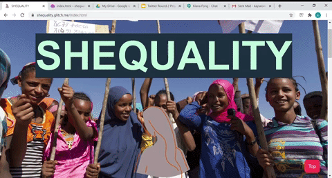
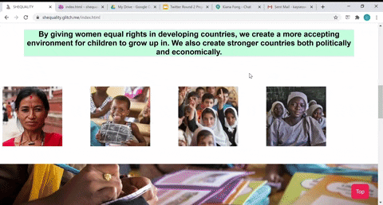

# SHEQUALITY
**:woman_technologist:[Kiana Fong](https://github.com/skittlers808) and [Kayley Seow](https://github.com/kayleyseow)'s GWC SIP Final Project, 2020 Twitter Cohort**  
**Take a look at Twitter's [@womeng](https://twitter.com/womeng) feature of our project: https://twitter.com/womeng/status/1296530932577570821**  
Check out our project here: https://kayleyseow.github.io/SHEQUALITY/  
Check out our code here: https://github.com/kayleyseow/SHEQUALITY    

# About Our Project  
**Our goal is to give women in developing countries the same opportunity as men in every aspect of life.**  

We chose this topic because we feel that gender equality needs to happen even if they don’t have all the resources. Through providing the resources and assistance, this will create stronger global connections and give everyone equal opportunities that they deserve. By giving women equal rights in developing countries, we create a more accepting environment for children to grow up in. We will also be able to create stronger countries both politically and economically.

We are an organization that seeks to bring light and change to gender inequality mainly in 3rd world countries. Us being both young women , we are able to see and feel the oppression of men and the major disparity of opportunities between men and women. Although we live in America, a country with the resources to equalize men and women, we still see the gap occuring whether it is in the work place, domestic sphere, or any other place where both men and women coexist. This means in developing countries or war zones, women are not given the same opportunities that men are whether it is intentional or just the natural hierarchy that people fail to knock down. Our organization hopes to end the gap between men and women in third world countries by providing them with opportunities such as a voice in politics, a spot on the newly formed Olympics team, or a desk to sit in at school.
# Challenges  
**Parallax** — Our major challenge was that we had problems with parallax implementation on the first page, because we designed our own website instead of using the template. After hours of debugging, and Camille's help, we were able to get it to work. Turns out we had a line of code which added in a 50% margin at the top of the page.  

**Multiple Files** — This is a minor challenge, but due to the nature of our website, we had many different files, especially CSS, because we had so many different pages with different features. Although this proved to be useful in the end, it was hard to ensure that each new change to style and design was implemented on each of our pages.  
# Features
**Favicon** — After designing our logo, we added a favicon to our website. You will be able to see the favicon when you open up our website and look at the tab. This feature was built solely using HTML.  

**Lightbox** — There is a modal image gallery in our first page, where you will be able to click on one of the four photos, and then you will be lead to a photo gallery with bigger, higer quality versions of the original photos. This feature is a result of both a modal box and an image slideshow. This feature was built using HTML, CSS, and JS.

**Parallax** — We were able to implement not one or two, but three parallaxes in our website, all on our home page. This feature was built using HTML and CSS.  

**Top Button** — We wrote the code for the top button at the bottom right corner of the page. This button appears depending on the page length, and once you click on it, you will be taken back to the top of the page, thus being able to use the navigation bar. This feature was built using HTML, CSS, and JS.  

**Buttons with Flexbox** — This was undoubtedly the most annoying part of the website. After finally understanding the entire concept of flexbox, we were able to use it to format the positioning of the buttons on the first page. This feature was built using HTML and CSS. 
# Demo
Here are the gifs we used on our slides to demo our features. You can also see them on our website, but they are here in gif form just in case you don't feel like visiting the website. Don't worry, we understand, our gifs are pretty cool.  
## Our Home Page
  
<h2> The Lightbox  </h2>
  
